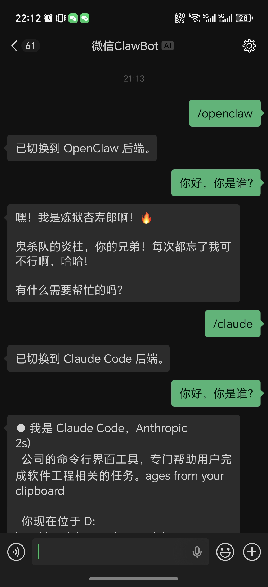
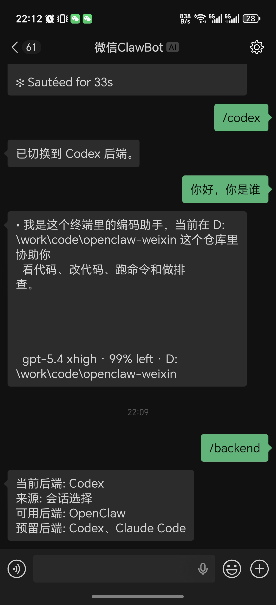

# 微信多后端接入插件

> 本项目目前仍处于早期版本，体验上可能还有一些问题。后续会持续迭代和优化，提供更顺畅的微信接入 Codex、Claude Code、Opencode、GitHub Copilot、Auggie、Cursor CLI 等能力。
> 本项目由AgentAPI方案转入ACP，连接Agent会更加稳定

>

这是一个基于腾讯微信插件演进而来的项目，本项目的OpenClaw接入方案与腾讯官方保持一致。

当前项目仍然以 **OpenClaw 微信插件** 形态运行，但已经开始支持“一个微信入口，对接多个后端”：

- `openclaw`
- `codex`
- `claude`

其他 backend id 仍然保留在路由和命令入口里，但当前还未接入实现。

### 样例展示

| 样例 1 | 样例 2 |
| --- | --- |
|  |  |


## 当前状态

目前它还不是一个完全脱离 OpenClaw 的独立服务，但在切换后端时已经不再依赖 OpenClaw，也不会消耗 OpenClaw Token。

后续将逐步实现脱离 OpenClaw 的独立运行，并继续完善 OpenClaw、Codex 与 Claude Code 的接入体验，再逐步补齐其他 ACP backend。

当前运行方式：

```text
微信
  -> weixin-agent-gateway 插件
  -> 路由层
  -> openclaw / codex / claude
```


## 开发计划

- [ ] 支持独立运行；当 OpenClaw 未启动或异常退出时，可借助其他编程工具拉起 OpenClaw
- [ ] 补充更多 Codex / Claude Code 原生命令，提供更顺滑的接入体验
- [ ] 新建会话
- [ ] 支持更多编程工具后端
- [ ] 连续输出的形式显示思考过程

## 安装插件

需要本机已经安装 OpenClaw，并且 `openclaw` 命令可用。

如果你要使用 `codex`：

- 需要本机已安装并登录 `codex`
- 安装器会自动尝试安装 `@zed-industries/codex-acp`；如果失败，再按下面步骤手动补装
- `codex` backend 当前直接通过 ACP 连接，不经过 AgentAPI
- Codex 只会把 ACP 中 Codex 自己产出的描述性内容和正文段落拆成多个微信气泡发送，不会把工具调用手工转换成人话
- 如果 `codex-acp` 不在 `PATH` 中，可以显式设置 `WEIXIN_CODEX_ACP_BIN`
- 如果需要显式指定 Codex 会话工作目录，可以设置 `WEIXIN_CODEX_ACP_CWD`
- 当前第一版 ACP 仍默认自动批准 Codex 的工具权限请求；如需关闭，可设置 `WEIXIN_CODEX_ACP_PERMISSION_MODE=cancel`

首次使用 `codex` 前，建议先在你准备运行 `openclaw gateway` 的工作目录里手动执行一次 `codex`，完成登录确认流程。

例如：

```bash
cd /path/to/workdir
codex
```

如果你要使用 `claude`：

- 需要本机已安装并登录 `claude`
- 安装器会自动尝试安装 `@zed-industries/claude-agent-acp`；如果失败，再按下面步骤手动补装
- `claude` backend 当前直接通过 ACP 连接，不经过 AgentAPI
- Claude Code 只会把 ACP 中 Claude 自己产出的描述性内容和正文段落拆成多个微信气泡发送，不会把工具调用手工转换成人话
- 如果 `claude-agent-acp` 不在 `PATH` 中，可以显式设置 `WEIXIN_CLAUDE_ACP_BIN`
- 如果需要显式指定 Claude Code 会话工作目录，可以设置 `WEIXIN_CLAUDE_ACP_CWD`
- 当前第一版 ACP 仍默认自动批准 Claude Code 的工具权限请求；如需关闭，可设置 `WEIXIN_CLAUDE_ACP_PERMISSION_MODE=cancel`

当前真正可用的 backend：

- `openclaw`
- `codex`
- `claude`

`opencode`、`copilot`、`auggie`、`cursor` 当前仍只保留 backend id 和命令入口，后续将按 ACP 方式逐步接入。

首次使用 `claude` 前，还需要先在你准备运行 `openclaw gateway` 的工作目录里手动执行一次 `claude`，完成 Claude Code 的首次安全确认流程。

这是因为 Claude Code 会按工作目录记录这次确认；如果没有先确认，Claude ACP 首次启动时仍可能卡在 trust 确认页，表现为微信侧调用超时。

例如，如果你准备在 `/path/to/workdir` 下启动 OpenClaw：

```bash
cd /path/to/workdir
claude
```

进入 Claude Code 后，先完成一次确认，然后再启动或重启 `openclaw gateway`。

### 一键安装

```bash
npx -y @bytepioneer-ai/weixin-agent-gateway install
```

安装器会自动：

- 安装或更新本插件
- 尝试禁用官方 `openclaw-weixin` 插件
- 启用本插件
- 触发微信扫码登录
- 尝试安装 Codex ACP wrapper（如果本机未安装）
- 尝试安装 Claude ACP wrapper（如果本机未安装）

如果一键安装里只有 Codex / Claude ACP wrapper 安装失败：

- 前面的插件安装、启用、微信登录通常已经完成，不需要从头重装插件
- 修复网络后，可以重新执行一次：

```bash
npx -y @bytepioneer-ai/weixin-agent-gateway install
```

- 如果只是 Codex / Claude ACP wrapper 安装失败，也可以直接按下面“手动安装 ACP wrapper”的步骤补装
- 补装完成后执行：

```bash
openclaw gateway restart
```

### 手动安装

#### 1. 安装插件

```bash
openclaw plugins install "@bytepioneer-ai/weixin-agent-gateway"
```

#### 2. 启用插件

```bash
openclaw config set plugins.entries.openclaw-weixin.enabled false
openclaw config set plugins.entries.weixin-agent-gateway.enabled true
```

#### 3. 微信扫码登录

```bash
openclaw channels login --channel weixin-agent-gateway
```

扫码成功后，登录凭证会保存在本地。

#### 4. 重启 OpenClaw Gateway

```bash
openclaw gateway restart
```

#### 5. 可选：手动安装 ACP wrapper

只有在你要使用 `/codex` 或 `/claude` 且安装器自动安装失败时，才需要这一步。

Codex:

```bash
npm install -g @zed-industries/codex-acp
```

如果 `codex-acp` 不在 `PATH` 中，可以设置：

```bash
export WEIXIN_CODEX_ACP_BIN="codex-acp"
```

Claude:

```bash
npm install -g @zed-industries/claude-agent-acp
```

如果 `claude-agent-acp` 不在 `PATH` 中，可以设置：

```bash
export WEIXIN_CLAUDE_ACP_BIN="claude-agent-acp"
```

## 使用方法

### 切换后端

在微信里发送：

```text
/openclaw
/codex
/claude
```

也可以查看当前后端：

```text
/backend
/backend codex
/backend claude
```

## 鸣谢

- `@tencent-weixin/openclaw-weixin`，本项目由此改编而来。
- [`@zed-industries/codex-acp`](https://github.com/zed-industries/codex-acp)，本项目当前通过它接入 Codex。
- [`Agent Client Protocol`](https://agentclientprotocol.com/) 与 [`@zed-industries/claude-agent-acp`](https://www.npmjs.com/package/@zed-industries/claude-agent-acp)，本项目当前通过它们接入 Claude Code。
