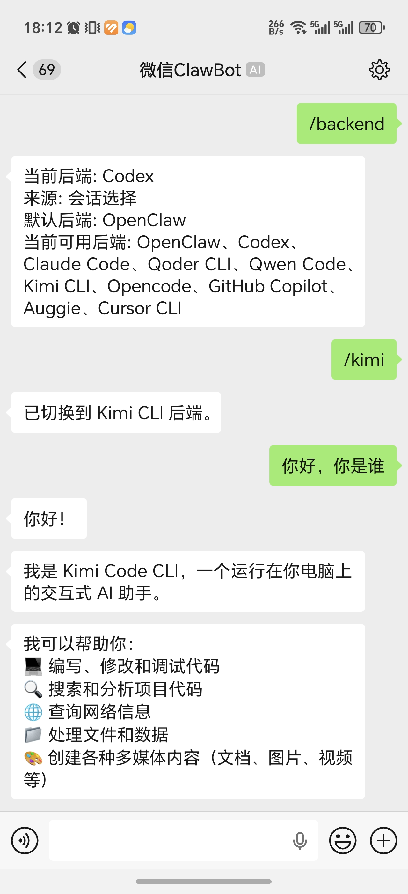
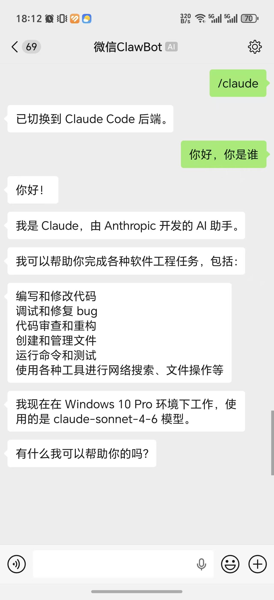
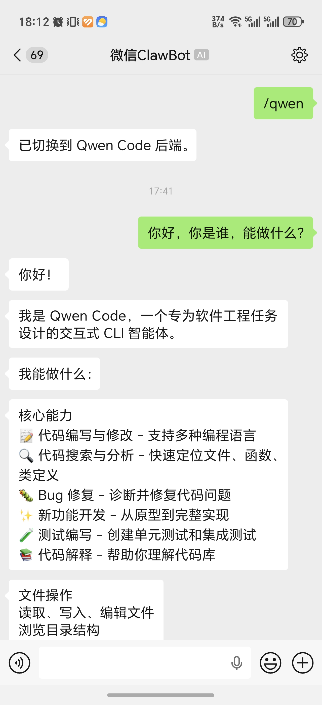

# 微信多后端接入插件

> 本项目目前仍处于早期版本，体验上可能还有一些问题。后续会持续迭代和优化，提供更顺畅的微信接入 Codex、Claude Code、Qoder CLI、Qwen Code、Kimi CLI、OpenCode、GitHub Copilot、Auggie、Cursor CLI 等能力。
> 本项目由 AgentAPI 方案转入 ACP，连接 Agent 会更加稳定。

这是一个基于腾讯微信插件演进而来的项目，本项目的 OpenClaw 接入方案与腾讯官方保持一致。

当前项目仍然以 **OpenClaw 微信插件** 形态运行，但已经开始支持“一个微信入口，对接多个后端”：

- `openclaw`
- `codex`
- `claude`
- `qoder`
- `qwen`
- `kimi`
- `opencode`
- `copilot`
- `auggie`
- `cursor`

## 兼容性

当前分支要求 `OpenClaw >= 2026.3.22`。

插件在启动时会检查宿主版本；如果 OpenClaw 版本过旧，会直接拒绝加载，避免在不兼容宿主上进入半可用状态。

查看当前宿主版本：

```bash
openclaw --version
```

### 样例展示

| 样例 1 | 样例 2 | 样例 3 |
| --- | --- | --- |
|  |  |  |

## 当前状态

目前它还不是一个完全脱离 OpenClaw 的独立服务，但在切换到 lightweight backend 时已经不再依赖 OpenClaw reply runtime，也不会消耗 OpenClaw Token。

当前运行方式：

```text
微信
  -> weixin-agent-gateway 插件
  -> 路由层
  -> openclaw / codex / claude / qoder / qwen / kimi / opencode / copilot / auggie / cursor
```

## 开发计划

- [ ] 支持独立运行；当 OpenClaw 未启动或异常退出时，可借助其他编程工具拉起 OpenClaw
- [ ] 补充更多各 backend 的原生命令，提供更顺滑的接入体验
- [ ] 新建会话
- [ ] 连续输出的形式显示思考过程

## 安装插件

### 一键安装

```bash
npx -y @bytepioneer-ai/weixin-agent-gateway install
```

安装器会自动：

- 安装或更新本插件
- 尝试禁用官方 `openclaw-weixin` 插件
- 启用本插件
- 触发微信扫码登录
- 尝试安装 Codex ACP wrapper（如果本机未安装）
- 尝试安装 Claude ACP wrapper（如果本机未安装）

当前一键安装主要覆盖插件本体、微信登录，以及 `codex` / `claude` 的 wrapper 安装。
`qoder` / `qwen` / `kimi` / `opencode` / `copilot` / `auggie` / `cursor` 仍建议按下面步骤手动安装对应 CLI。

### 本地源码安装

```bash
git clone https://github.com/BytePioneer-AI/weixin-agent-gateway.git
cd weixin-agent-gateway
npm run local:setup
```

底层等价于在源码目录执行：

```bash
openclaw plugins install -l .
```

### 手动安装

#### 1. 安装插件

```bash
openclaw plugins install "@bytepioneer-ai/weixin-agent-gateway"
```

#### 2. 启用插件

> 如果之前安装了微信的 openclaw-weixin，需要禁用，否则会出现 OpenClaw 的重复安装

```bash
openclaw config set plugins.entries.openclaw-weixin.enabled false
openclaw config set plugins.entries.weixin-agent-gateway.enabled true
```

#### 3. 微信扫码登录

```bash
openclaw channels login --channel weixin-agent-gateway
```

扫码成功后，登录凭证会保存在本地。

#### 4. 重启 OpenClaw Gateway

```bash
openclaw gateway restart
```

## Backend 登录准备

首次使用前，建议先在你准备运行 `openclaw gateway` 的工作目录里手动执行对应命令，完成登录或信任确认流程。

- `codex`: 先执行一次 `codex`
- `claude`: 先执行一次 `claude`
- `qoder`: 先执行一次 `qodercli`，并在会话里完成 `/login`，或设置 `QODER_PERSONAL_ACCESS_TOKEN`
- `qwen`: 先执行一次 `qwen`
- `kimi`: 先执行一次 `kimi`，并在会话里完成 `/login`
- `opencode`: 先执行一次 `opencode auth login`，或手动启动 `opencode`
- `copilot`: 先执行一次 `copilot login`
- `auggie`: 先执行一次 `auggie login`
- `cursor`: 先执行一次 `cursor-agent login`，或设置 `CURSOR_API_KEY`

## 使用方法

### 切换后端

在微信里发送：

```text
/openclaw
/codex
/claude
/qoder
/qwen
/kimi
/opencode
/copilot
/auggie
/cursor
```

也可以查看或切换当前后端：

```text
/backend
/backend codex
/backend claude
/backend qoder
/backend qwen
/backend kimi
/backend opencode
/backend copilot
/backend auggie
/backend cursor
```

## 鸣谢

- `@tencent-weixin/openclaw-weixin`，本项目由此改编而来。
- [`@zed-industries/codex-acp`](https://github.com/zed-industries/codex-acp)，本项目当前通过它接入 Codex。
- [`Agent Client Protocol`](https://agentclientprotocol.com/) 与 [`@zed-industries/claude-agent-acp`](https://www.npmjs.com/package/@zed-industries/claude-agent-acp)，本项目当前通过它们接入 Claude Code。
- OpenCode、GitHub Copilot CLI、Auggie CLI、Cursor CLI 的官方 ACP / CLI 能力，为本项目的 backend 接入提供了基础。
